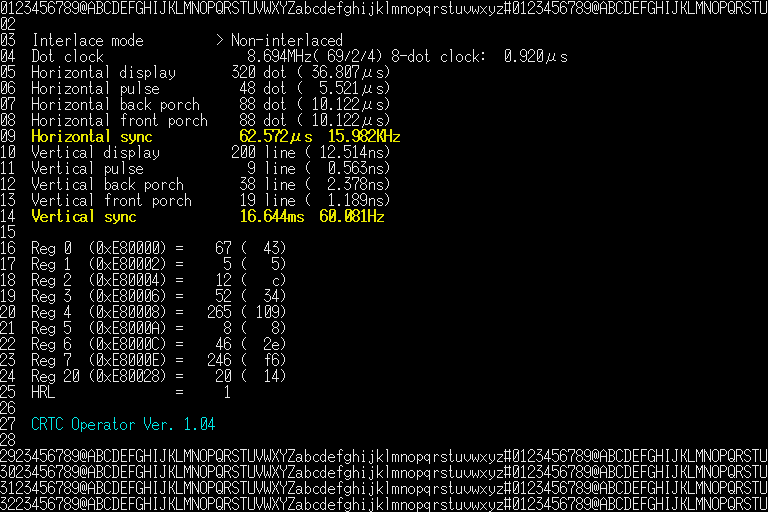

CRTC is a tool to help design screen resolutions for the X68000 by setting the CRTC registers values 
of the machine and generating the ASM code to re-use them in user's own programs.

It's based on an old tool from Taka2, read crtc.txt for more infos.

